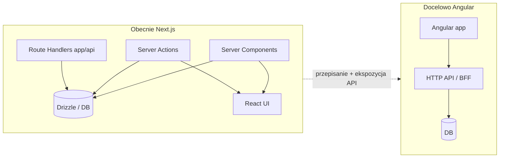

# Weryfikacja możliwości przejścia na Angular (GymBrat)

## Stan obecny

- **Stack UI**: [package.json](c:\Users\Damian\Desktop\GymBrat\package.json) — Next.js **16.2**, React **19**, Tailwind 4, shadcn / `@base-ui/react`, Framer Motion, Recharts, Zustand, React Hook Form, Zod.
- **Backend w monolicie Next**: Drizzle ORM, `@auth/drizzle-adapter`, NextAuth v5, ok. **25** tras w [app/api](c:\Users\Damian\Desktop\GymBrat\app\api), cron, Sentry, Upstash.
- **Wzorzec danych na stronach**: strony dashboardu to **Server Components** — np. [app/(dashboard)/page.tsx](c:\Users\Damian\Desktop\GymBrat\app\(dashboard)\page.tsx) wywołuje `auth()`, `getDb()`, zapytania Drizzle i funkcje z `lib/` **bezpośrednio na serwerze**, a potem przekazuje wyniki do komponentów klienckich.
- **Mutacje**: wiele plików w [actions/](c:\Users\Damian\Desktop\GymBrat\actions) z `"use server"` (Server Actions) — to nie jest zwykły REST; Angular musiałby wołać **HTTP API** (np. rozszerzyć istniejące `app/api` albo wydzielić osobny serwer).
- **Skala UI**: rząd wielkości **100+** plików `.tsx` w `app/` i `components/` (w tym ~70+ z `"use client"`).
- **Osobny serwis**: [fitatu-bridge](c:\Users\Damian\Desktop\GymBrat\fitatu-bridge) (Hono) — **nie blokuje** migracji UI; może zostać bez zmian lub dalej współpracować z nowym frontem przez HTTP.

## Czy można przejść na Angular?

| Aspekt | Ocena |
|--------|--------|
| **Możliwość techniczna** | Tak — Angular to dojrzały framework; nic w projekcie nie jest „fizycznie niemożliwe” do zastąpienia. |
| **Koszt / ryzyko** | **Bardzo wysoki** — nie jest to „podmiana biblioteki”, tylko **nowa aplikacja frontowa** + **warstwa API** na całą logikę obecnie w RSC i Server Actions. |
| **Reuse kodu UI** | **Minimalny** — komponenty TSX, shadcn, hooki React nie przenoszą się do Angulara; szablony, DI, RxJS, routing Angulara to osobny świat. |
| **Reuse logiki domenowej** | **Częściowy** — typy Zod, czyste funkcje z `lib/` można **stopniowo** współdzielić (np. pakiet npm w monorepo), ale integracja z szablonami Angulara i formularzami i tak wymaga pracy. |
| **Auth** | NextAuth jest **mocno związany z Next**. Warianty: osobny backend auth (np. Nest + Passport), lub utrzymanie cienkiego BFF w Node i cookies/sesje zgodne z obecnym modelem — wymaga **projektu**, nie tylko podmiany frameworka. |

## Realistyczne ścieżki (jeśli kiedyś decyzja „tak”)

1. **Angular SPA + API (zalecane przy migracji)**  
   Wydzielić lub rozbudować REST/JSON API pokrywające obecne Server Actions i odczyty z RSC; Angular tylko jako klient. Next można stopniowo wycinać z UI albo zastąpić innym hostem API (np. NestJS).

2. **Angular SSR (Universal)**  
   Nadal potrzebujesz **tego samego** zestawu endpointów lub BFF do bazy — Universal nie zastępuje Server Actions ani bezpośredniego Drizzle w RSC w ten sam sposób co Next.

3. **Hybryda Next + Angular**  
   Teoretycznie możliwa (np. iframe / osobna subdomena), ale **droga w utrzymaniu** i nie rozwiązuje duplikacji auth ani danych bez solidnego API.

## Wnioski

- **„Czy można?”** — **tak**, technicznie.  
- **„Czy to ma sens jako refaktor?”** — raczej **nie** bez silnego biznesowego powodu (np. wymóg organizacji, długoterminowy standard na Angularze, zespół tylko pod Angular); koszt jest zbliżony do **nowego frontu** przy **istniejącej** domenie i bazie.  
- **Największe bloki pracy**: (1) pełne API zamiast RSC + Server Actions, (2) przepisanie całego UI i formularzy, (3) auth i bezpieczeństwo (CSRF, sesje) dopasowane do SPA.

Jeśli celem jest np. **tylko** silniejsza struktura typów lub mniejsza „magia” frameworka, warto najpierw rozważyć **utrwalenie obecnego stacku** (Next + TS + modularizacja `lib/`) zamiast migracji na Angular — znacznie mniejszy koszt przy tym samym produkcie.
